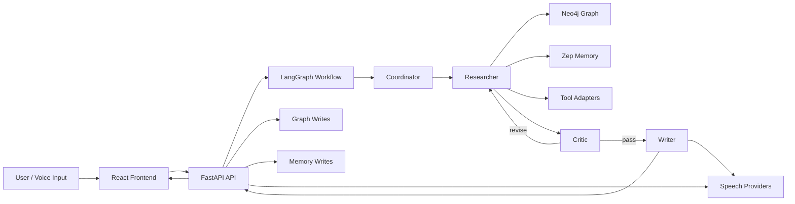

# KG Multi-Agent System

A Dockerized multi-agent AI operations system built around LangGraph orchestration, Neo4j lineage, Zep memory, provider-aware model routing, voice interaction, and a React operations dashboard.

This repository is not a thin mockup. It contains a working end-to-end system with:
- a coordinator/researcher/critic/writer workflow
- specialist agents for shopping, social, secretary, and wellness coaching
- graph + memory persistence
- realtime event streaming
- configurable agent identities and model assignments
- voice input/output
- open-model discovery via Hugging Face
- document processing and visual report workbenches
- desktop automation workflows and local artifact generation
- Google Workspace ingestion with OAuth-backed Gmail/Calendar workflows
- scheduleable desktop workflow policies with backend dispatch support
- an operator inbox that consolidates approvals, failures, blocked actions, and setup gaps
- route-decision, latency, and policy-version telemetry on runs

The app is designed to operate as a serious personal operations system. It is still not a safety-critical system, but it now includes approval gates, operator inboxes, schedule runners, desktop history, provider health, and specialist routing meant for real daily use.

## Contents
- [What It Does](#what-it-does)
- [Current Capabilities](#current-capabilities)
- [Architecture](#architecture)
- [Repository Layout](#repository-layout)
- [Runtime Services](#runtime-services)
- [Frontend Overview](#frontend-overview)
- [Backend API](#backend-api)
- [Agent Workflow](#agent-workflow)
- [Memory And Graph Model](#memory-and-graph-model)
- [Model Providers](#model-providers)
- [Voice And Speech](#voice-and-speech)
- [Hugging Face Integration](#hugging-face-integration)
- [Environment Variables](#environment-variables)
- [Local Development](#local-development)
- [Docker Usage](#docker-usage)
- [Railway Deployment](#railway-deployment)
- [Operational Notes](#operational-notes)
- [Testing And Validation](#testing-and-validation)
- [Known Limitations](#known-limitations)
- [Troubleshooting](#troubleshooting)

## What It Does

The application accepts a user task or spoken prompt and routes it through a LangGraph workflow.

Typical run behavior:
1. The coordinator classifies the task, plans the route, and establishes memory/thread context.
2. The researcher gathers evidence from tools, memory, and graph state.
3. The critic evaluates quality, coverage, and risk, and can send the workflow back for revision.
4. The writer produces the final response and a spoken-response variant.
5. The app writes graph lineage, claims, entities, tool executions, and memory episodes during the run.
6. The frontend shows live events, graph updates, health, and memory state.

The demo supports both ordinary conversation and structured task execution.

## Current Capabilities

### Multi-agent execution
- `coordinator -> researcher -> critic -> writer`
- conditional revision loop from critic back to researcher
- degraded fallback path on repeated failure
- task classification so normal conversation is not forced through research templates
- conservative specialist routing so the coordinator keeps ordinary conversation unless specialist intent is explicit or strong
- explicit saved-name routing so named agents such as `Nora` or the wellness coach can be invoked directly
- route decision metadata, policy version, prompt version, and per-run latency telemetry

### Graph and memory
- Neo4j run/thread/episode/claim/entity lineage
- Zep long-term memory integration
- thread-aware memory recall
- episode timeline and claim surfacing in UI

### Voice interaction
- browser speech recognition for input
- microphone-driven visualizer response while the user is speaking
- browser speech synthesis
- OpenAI neural TTS
- ElevenLabs integration path
- Hugging Face Parler TTS integration path
- speaking/listening visualizer modes
- coordinator acknowledgement speech before full run completion
- interruption handling and duplicate/echo suppression

### Provider-aware routing
- OpenAI
- Anthropic
- Google Gemini support path
- Perplexity support path
- xAI support path
- Groq support path
- OpenRouter
- Transformers-local integration hook
- optional Optimum hook for local acceleration

### UI configuration
- editable agent names
- per-agent avatars:
  - emoji/text
  - image URL
  - local file upload
- per-agent speech settings
- per-agent model/provider assignment
- org-chart display of agent hierarchy
- theme selector
- active agent spotlight during speech
- predicted route badge before run start
- actual route and latency metadata surfaced in Run Status
- unified operator inbox for approvals, failures, blocked actions, and setup gaps

### Desktop operations
- per-agent local app specialization policies
- host-bridge aware desktop execution model
- local writer doc generation
- local social package generation
- Gmail/Calendar desktop workflows
- AI Influencer desktop packaging
- scheduled wellness check-in artifacts
- desktop action history with filtering
- bridge diagnostics for Finder, Word, and AI Influencer launch
- persisted desktop workflow schedules

### External integrations
- Twilio / Telnyx / SendGrid / Telegram secretary dispatch path
- Hugging Face hub/dataset/Spaces search
- Google Workspace OAuth connect flow for Gmail/Calendar readonly workflows

### Personal operations layer
- secretary contacts with saved preferred channel/provider and richer CRM metadata
- operator inbox summarizing approvals, failed runs, blocked actions, and config gaps
- wellness coach agent for goals, habits, accountability, recovery, and motivation
- desktop-scheduled wellness check-ins with reusable templates and output folders

### Captain Claw-inspired surfaces
- Flight Deck capability deck
- browser ops workspace with saved web workflows
- document processing workbench
- visual run reports
- focused operator boards instead of a permanently crowded dashboard

## Google Workspace Setup

The app now supports a local OAuth flow for Gmail and Google Calendar.

What it does:
- opens a Google consent screen from the app
- receives the callback at the backend
- stores the Google refresh/access token locally
- refreshes access automatically for Gmail/Calendar desktop workflows

### 1. Create Google OAuth credentials

In Google Cloud Console:
1. Create or choose a project
2. Enable:
   - Gmail API
   - Google Calendar API
3. Go to `APIs & Services -> Credentials`
4. Create an `OAuth client ID`
5. Choose `Web application`
6. Add this authorized redirect URI exactly:

```text
http://localhost:8000/google/oauth/callback
```

### 2. Add env vars

In the project root `.env`:

```env
GOOGLE_OAUTH_CLIENT_ID=your_google_client_id
GOOGLE_OAUTH_CLIENT_SECRET=your_google_client_secret
GOOGLE_OAUTH_REDIRECT_URI=http://localhost:8000/google/oauth/callback
```

Optional manual override:

```env
GOOGLE_WORKSPACE_ACCESS_TOKEN=
```

The normal path should be OAuth, not manual token entry.

### 3. Connect from the UI

1. Open `Studio -> Desktop`
2. Click `Connect Google Workspace`
3. Sign in with Google
4. Approve:
   - Gmail readonly
   - Calendar readonly
5. Return to the app

The Desktop panel will then show:
- connected state
- token source
- expiry
- granted scope
- whether refresh is available

### 4. Supported Google action types

The Gmail / Calendar workflow supports:
- `snapshot`
- `inbox_triage`
- `agenda_brief`
- `conflict_scan`
- `morning_brief`
- `draft_reply_suggestions`

These produce local markdown output in the desktop exports folder under:

```text
backend/data/exports/gmail_calendar/
```

`morning_brief` combines inbox priorities, upcoming calendar items, and detected conflicts into one operator-friendly brief.

`draft_reply_suggestions` does not send email. It produces local reply recommendations only.

## Architecture



The backend is built around explicit service layers rather than a monolithic agent framework.

## Repository Layout

```text
backend/
  app/
    agents/
      nodes.py                 # agent node logic and speech shaping
    api/
      routes.py                # FastAPI routes
    core/
      config.py                # environment-driven settings
    graph/
      state.py                 # AgentState schema
    models/
      schemas.py               # API and profile schemas
    repositories/
      run_store.py             # durable run persistence
    services/
      agent_profile_service.py # agent config persistence
      huggingface_service.py   # HF Hub, Parler, local transformers hooks
      memory_service.py        # Zep thread memory
      model_router_service.py  # provider/model resolution
      neo4j_service.py         # graph writes and reads
      run_service.py           # run lifecycle
      tts_service.py           # routed speech synthesis
    tools/
      adapters.py              # tool adapters and discovery tools
    workers/
      celery_app.py            # Celery worker bootstrap
frontend/
  src/
    components/
      CapabilityDeckPanel.tsx
      DocumentWorkbenchPanel.tsx
      ReportWorkbenchPanel.tsx
      RunConsole.tsx
      HealthPanel.tsx
      GraphPanel.tsx
      MemoryPanel.tsx
      AgentStudio.tsx
      HuggingFacePanel.tsx
      SecretaryPanel.tsx
    api/
      client.ts
    lib/
      presets.ts
      themes.ts
      voice.ts
    types.ts
infra/
  docker-compose.yml
README.md
.env.example
```

## Runtime Services

### `api`
FastAPI service that exposes:
- runs
- events
- graph
- memory
- health
- speech
- agent configuration
- provider catalog
- Hugging Face search

### `worker`
Celery worker for queued/background work.

### `neo4j`
Operational graph store for:
- runs
- threads
- episodes
- claims
- entities
- tool executions
- provenance relationships

### `postgres`
Persistence substrate used by the app and runtime services.

### `redis`
Broker/cache role for queueing and background workflows.

### `frontend`
React + Vite app served in Docker through nginx.

## Frontend Overview

The frontend is intentionally split into workspace tabs so the screen is not overloaded.

### 1. Mission Control
Primary interaction area.

Includes:
- voice controls
- visualizer
- run prompt and mode
- live event stream
- transcript
- mission templates

### 2. Graph And Memory
Observability and reasoning state.

Includes:
- live graph view
- graph filters/search
- thread context
- recalled memory references
- entities
- claims
- episode timeline
- desktop artifacts
- recent thread messages

### 3. Specialist Boards
Focused operator views.

Includes:
- Shopping Board
- Social Ops
- Secretary Ops

### 4. Studio
Configuration and external system surfaces.

Includes:
- Flight Deck capability deck
- Agent Studio
- Hugging Face search panel
- Browser Ops
- Document Workbench
- Report Workbench
- Desktop Ops
- Desktop History

## Backend API

### Runs
- `POST /runs`
  - starts a run
  - body: `{"task": string, "mode": "simulation" | "live"}`
- `GET /runs/{run_id}`
  - returns run detail, state, output, timestamps
- `GET /runs/{run_id}/events`
  - SSE event stream
- `GET /runs/{run_id}/speech`
  - synthesized speech for the run response

### Memory and graph
- `GET /runs/{run_id}/memory`
- `GET /runs/{run_id}/claims`
- `GET /threads/{thread_id}`
- `GET /graph?limit=...&run_id=...&thread_id=...`

### Desktop ops
- `GET /desktop/status`
- `GET /desktop/actions`
- `POST /desktop/actions/writer-doc`
- `POST /desktop/actions/social-package`
- `POST /desktop/actions/gmail-calendar`
- `POST /desktop/actions/ai-influencer`
- `POST /desktop/actions/{action_id}/execute`
- `POST /desktop/actions/{action_id}/open`
- `POST /desktop/actions/{action_id}/reveal`
- `GET /desktop/bridge/status`
- `GET /desktop/bridge/diagnostics`
- `POST /desktop/bridge/test`
- `POST /desktop/bridge/test/{kind}`
- `GET /desktop/schedules`
- `POST /desktop/schedules`
- `POST /desktop/schedules/dispatch`

### Config and health
- `GET /health`
- `GET /providers/catalog`
- `GET /agents/config`
- `PUT /agents/config`
- `GET /browser/inspect?url=...`
- `GET /browser/workflows`
- `POST /browser/workflows`
- `POST /browser/workflows/{workflow_id}/run`
- `GET /secretary/status`
- `POST /secretary/dispatch`
- `POST /documents/process`
- `GET /reports/run/{run_id}`

### Hugging Face
- `GET /hf/status`
- `GET /hf/models`
- `GET /hf/datasets`
- `GET /hf/spaces`


## Agent Workflow

The current workflow is stateful and conditional.

### Coordinator
Responsibilities:
- classify task type
- establish memory/thread context
- choose route
- assign baseline plan metadata

### Researcher
Responsibilities:
- gather evidence
- call tools
- query memory/graph context
- collect sources and findings

### Critic
Responsibilities:
- inspect coverage and factual quality
- request revision if needed
- emit pass/fail verdict

### Writer
Responsibilities:
- produce final answer
- shape spoken response variant
- emit speech preview events

### Degraded handler
Responsibilities:
- recover from repeated failures
- produce fallback output
- mark run state explicitly

## Memory And Graph Model

### Neo4j entities
Current graph model includes:
- `Run`
- `Thread`
- `Episode`
- `Entity`
- `Claim`
- `Source`
- `ToolExecution`
- `Agent`
- `DesktopArtifact`

Typical relationships include:
- `HAS_EPISODE`
- `CONTAINS`
- `MENTIONS`
- `PRODUCED`
- `SUPPORTED_BY`
- `CHALLENGED_BY`
- `ABOUT`
- `AUTHORED`
- `GENERATED`
- `FAILED_AT`
- `PRECEDES`

### Zep memory
The memory service is thread-aware rather than flat-session-only.

The app stores and recalls:
- user messages
- run episodes
- thread context
- memory references
- message history
- desktop-generated artifacts that have been ingested back into the run
- structured recall fields used by the workflow

### Desktop artifact ingestion
Completed desktop actions are no longer treated as terminal local file writes.

The current ingestion path can pull content back into the graph and memory model for:
- Gmail / Calendar snapshots and briefs
- writer markdown documents
- social package briefs
- AI Influencer package briefs

For ingested outputs, the system now creates:
- a new `Episode`
- a `DesktopArtifact` graph node
- thread/message memory records in Zep
- run-state references for UI recall

## Model Providers

The provider catalog is runtime-driven and exposed to the UI.

### Implemented/available paths
- OpenAI
- Anthropic
- OpenRouter
- Google Gemini support path
- Perplexity support path
- xAI support path
- Groq support path
- Transformers-local hook

### Role defaults
Current recommended defaults are function-specific and surfaced in the API catalog.

Examples:
- coordinator -> fast routing model
- researcher -> web/open-model friendly provider
- critic -> strong analysis model
- writer -> strong natural-language model
- coding -> coder-oriented model

### OpenRouter
OpenRouter is integrated as an OpenAI-compatible provider path with curated OSS presets.

The frontend includes preset packs for role-based OpenRouter routing.

## Voice And Speech

### Input
- browser Web Speech recognition
- silence-triggered run execution option
- interruption handling
- anti-echo / anti-repeat filtering

### Output
Supported engines in the UI:
- `Neural (OpenAI)`
- `Premium (ElevenLabs)`
- `Parler TTS (HF)`
- `Browser (local)`

### Current voice behavior
The system supports:
- per-agent voice assignment
- per-agent speech style
- per-agent spoken persona
- preview speech during active runs
- final speech after completion
- active speaker routing through the resolved `speaker_agent`
- coordinator acknowledgement speech before the full run finishes
- microphone-driven visualizer motion during listening

### Important note
Speech quality depends heavily on the selected provider.
- browser voices can sound more natural on macOS for some use cases
- OpenAI is integrated and usable
- ElevenLabs path exists but requires its own key
- Parler path exists, but HF inference responsiveness can vary

## Desktop Automation

### Execution model
Desktop automation in this project has three layers:
1. local artifact generation in the backend container
2. optional host bridge for macOS-native app control
3. per-agent permission/specialization rules in Agent Studio

The app can already generate local files reliably.

Native app control such as opening Word or revealing Finder paths requires the host bridge because the main backend runs in Docker/Linux.

### Current desktop action kinds
- `writer_doc`
- `social_package`
- `gmail_calendar`
- `ai_influencer`

### Desktop history
Desktop actions are persisted and exposed in the UI with:
- action kind
- owning agent
- status
- output path
- execution history
- last execution method
- last error

### Desktop schedules
Desktop schedules are now persisted and dispatchable.

Current supported scheduled workflow kinds:
- `morning_brief`
- `agenda_brief`
- `inbox_triage`
- `draft_reply_suggestions`

## Secretary Agent

The app now includes a secretary specialist:
- id: `secretary`
- default name: `Nora`

Purpose:
- place outbound calls
- send texts
- send emails
- prepare appointment and follow-up tasks

Current live providers:
- Twilio for calls and SMS
- SendGrid for email

Operational route:
- `GET /secretary/status`
- `POST /secretary/dispatch`

Important:
- `simulation` mode is the default safe path
- `live` mode only works when the corresponding provider credentials are configured

Required env vars for live secretary actions:
- `TWILIO_ACCOUNT_SID`
- `TWILIO_AUTH_TOKEN`
- `TWILIO_PHONE_NUMBER`
- `SENDGRID_API_KEY`
- `SECRETARY_EMAIL_FROM`

The demo does not silently place calls or send messages. Live execution is explicit.

## Documents And Reports

### Document processing

The app includes a document workbench in `Studio -> Documents`.

Route:
- `POST /documents/process`

Supported local demo extraction:
- `.txt`
- `.md`
- `.csv`
- `.json`
- `.html`
- source code files

The processor returns:
- extracted text
- simple section detection
- summary
- warnings when a file type is only partially supported

This is intentionally a lightweight workbench, not a full OCR or Office binary parser.

### Visual reports

The app includes a report workbench in `Studio -> Reports`.

Route:
- `GET /reports/run/{run_id}`

The report surface:
- renders a clean standalone HTML layout
- prints to PDF better than the live dashboard
- avoids the earlier issue where the full dashboard itself was being printed directly

## Browser Ops

The app now includes a browser operations workspace in `Studio -> Browser`.

Current capabilities:
- inspect a live URL
- extract title, description, H1, content type, and link count
- save rerunnable browser workflows
- rerun saved web research sweeps from the UI

Routes:
- `GET /browser/inspect?url=...`
- `GET /browser/workflows`
- `POST /browser/workflows`
- `POST /browser/workflows/{workflow_id}/run`

Important scope note:
- this is a real browser-research surface built on live page inspection and saved workflows
- it is not yet full Playwright recording or tab automation parity

Important constraint:
- schedule persistence and backend dispatch are implemented
- this is not yet a full user-facing automation product with recurrence editing, inbox items, and approval routing
- it is a backend scheduler plus UI policy layer designed to be expanded

## Host Bridge

The host bridge is a separate macOS-side service used to bridge Docker to local desktop apps.

Current capabilities:
- Word open
- Finder reveal
- generic file open
- browser open
- app open by name
- app open by full path

Current diagnostics:
- overall bridge reachability
- Finder test
- Word test
- AI Influencer launch test

Bridge code lives in:
- [host_bridge/server.py](host_bridge/server.py)
- [host_bridge/README.md](host_bridge/README.md)

See [SECURITY.md](SECURITY.md) for the full threat model and the controls in place.


### Pricing status
- free API credits are no longer generally offered

References:

## Hugging Face Integration

### Implemented
- Hub search for models
- dataset search
- Spaces search
- Parler TTS backend integration
- transformers-local provider hook
- optional optimum acceleration hook
- agent discovery tool integration

### Current runtime expectation
- Hub search works in the default stack
- Parler TTS is wired in, but inference latency may vary
- transformers-local and optimum remain disabled unless a local inference runtime is installed

## Environment Variables

Copy `.env.example` to `.env`.

### Core
- `OPENAI_API_KEY`
- `ZEP_API_KEY`
- `NEO4J_URI`
- `NEO4J_USER`
- `NEO4J_PASSWORD`
- `POSTGRES_DSN`
- `REDIS_URL`

### Provider keys
- `ANTHROPIC_API_KEY`
- `GOOGLE_API_KEY`
- `PERPLEXITY_API_KEY`
- `XAI_API_KEY`
- `GROQ_API_KEY`
- `OPENROUTER_API_KEY`
- `HUGGINGFACE_API_KEY`

### Voice
- `OPENAI_TTS_MODEL`
- `OPENAI_TTS_VOICE`
- `ELEVENLABS_API_KEY`
- `ELEVENLABS_VOICE_ID`
- `PARLER_TTS_MODEL`
- `PARLER_TTS_VOICE_DESCRIPTION`

### Local HF inference hooks
- `TRANSFORMERS_LOCAL_MODEL`
- `TRANSFORMERS_DEVICE`
- `TRANSFORMERS_USE_OPTIMUM`
- `TRANSFORMERS_MAX_NEW_TOKENS`

- `HEYGEN_API_KEY`
- `HEYGEN_BASE_URL`
- `HEYGEN_AVATAR_ID`
- `HEYGEN_VOICE_ID`
- `HEYGEN_AGENT_AUTO_SYNC`

### Secretary live actions
- `TWILIO_ACCOUNT_SID`
- `TWILIO_AUTH_TOKEN`
- `TWILIO_PHONE_NUMBER`
- `SENDGRID_API_KEY`
- `SECRETARY_EMAIL_FROM`

## Local Development

### Backend
```bash
cd backend
python3 -m venv .venv
source .venv/bin/activate
pip install -e .
uvicorn app.main:app --reload
```

### Frontend
```bash
cd frontend
npm install
npm run dev
```

### Recommended local URLs
- frontend: `http://localhost:5173`
- API: `http://localhost:8000`
- Neo4j Browser: `http://localhost:7474`

## Docker Usage

Start the full stack:

```bash
docker compose -f infra/docker-compose.yml up --build
```

Rebuild only API + frontend:

```bash
docker compose -f infra/docker-compose.yml up -d --build api frontend
```

Rebuild with forced recreation if Docker keeps stale containers around:

```bash
docker compose -f infra/docker-compose.yml up -d --build --force-recreate api frontend
```

## Railway Deployment

The project is structured for multi-service deployment.

Recommended services:
- frontend
- api
- worker
- postgres
- redis
- neo4j

Recommended public-demo defaults:
- keep run mode defaulted to `simulation`
- restrict live side effects
- do not expose raw admin/provider secrets client-side

## Operational Notes

### Voice quality
If you want materially more human speech, provider choice matters more than prompt wording.

Priority order:
1. premium TTS provider
2. tuned browser voice on macOS
3. OpenAI TTS
4. Parler path when latency is acceptable

### Local model path
`transformers-local` and `optimum` are scaffolding hooks unless you install a local runtime with `torch` and possibly ONNX runtime.

### Print/PDF
The frontend now includes print-specific CSS so exported PDFs are readable and not just a raw dump of the live dashboard layout.

## Testing And Validation

### Manual checks
- Start a run from the console
- Verify live events update
- Verify graph panel loads and filters
- Verify memory panel loads run/thread context
- Verify provider catalog surfaces enabled providers
- Verify agent edits persist after refresh
- Verify voice speaking/listening visualizer remains visible during speech
- Verify PDF export uses print-friendly layout

### Automated checks used during development
- `python3 -m py_compile ...` for backend syntax checks
- `npm run build` for frontend build validation

## Known Limitations

- Speech quality is still bounded by the active TTS provider.
- Parler TTS is integrated but HF inference latency can be inconsistent.
- `transformers-local` is not active in the default Docker image.
- The worker/runtime path should be treated as a demo system until task registration and background behavior are hardened further.

## Troubleshooting

### UI text is clipped or hidden
- hard refresh the frontend
- ensure the rebuilt frontend container is the one currently running
- reduce browser zoom and compare with the print layout if you are diagnosing export issues

### Voice sounds robotic
- try `Browser (local)` on macOS first
- if available, add a premium TTS provider key
- avoid long list-heavy prompts when evaluating speech quality

### Visualizer stops during speech
- confirm the latest frontend build is running
- verify the selected voice engine is not failing over repeatedly
- use the browser engine to test whether the issue is remote-audio-specific

### Runs stay queued or never complete
- inspect API and worker logs
- verify Redis/Postgres are up
- verify the worker has loaded the expected tasks

### Hugging Face local models show disabled
- expected unless you install local inference dependencies and configure a local model runtime

